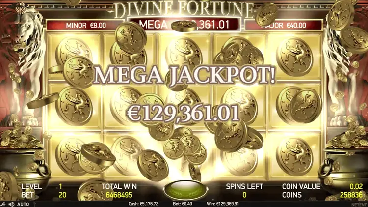
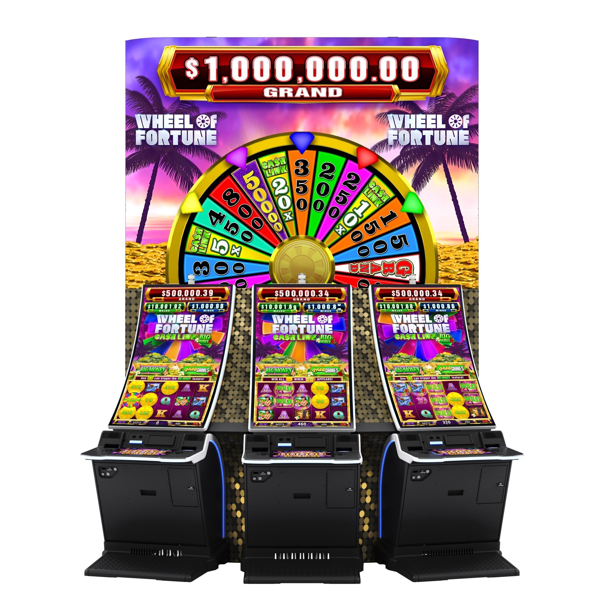

# Slot Machine Domain Research

Domain research document for the Tech Warmup II: Better Slot Machine project.

---

## Table of Contents

1. [Domain Overview](#1-domain-overview)
2. [Historical Evolution](#2-historical-evolution)
3. [Core Components](#3-core-components)
4. [Game Mechanics](#4-game-mechanics)
5. [Rule Systems (Win Evaluation Rules)](#5-rule-systems-win-evaluation-rules)
6. [Math Model](#6-math-model)
7. [Analysis of 7 Most Popuplar Slots](#7-analysis-of-7-most-popular-slots)
8. [Demographics and Behavioral Profile of Frequent Slot Players](#8-demographics-and-behavioral-profile-of-frequent-slot-players)

---

## 1. Domain Overview

A slot machine is a probability-based betting game that determines outcomes and payouts from symbol combinations on spinning reels. It exists in physical (land-based) and digital (online/mobile) forms, and at its core is a Random Number Generator (RNG) that produces results.

---

## 2. Historical Evolution

| Era     | Technology                     | Representative                                            |
| ------- | ------------------------------ | --------------------------------------------------------- |
| 1891    | Mechanical                     | Sittman & Pitt (NYC, poker machine)                       |
| 1895    | Mechanical 3-reel              | Charles Fey's Liberty Bell, the prototype of modern slots |
| 1960s   | Electromechanical              | Bally "Money Honey" (automatic payout)                    |
| 1976    | Video slot                     | Fortune Coin (Las Vegas)                                  |
| 1996+   | Online                         | Microgaming, NetEnt                                       |
| 2010+   | Mobile / HTML5                 | Play'n GO, Pragmatic Play                                 |
| Present | Megaways, VR, blockchain slots | Big Time Gaming and others                                |

The key evolutionary shift: mechanical fixed probability moved to a programmable RNG. This made paytables and volatility freely configurable at the software level.

---

## 3. Core Components

| Component              | Description                                                                                     |
| ---------------------- | ----------------------------------------------------------------------------------------------- |
| Reel                   | A spinning strip of symbols. Typically 3 or 5 reels                                             |
| Symbol                 | Images on the reel. Types include Regular, Wild (substitute), Scatter (trigger), Bonus          |
| Payline                | Winning judgment path. 1 line, 5 lines, 25 lines, 243 ways, up to Megaways (117,649 ways)       |
| Paytable               | Payout table for symbol combinations                                                            |
| RNG                    | Random number generator that decides outcomes. Usually Mersenne Twister or a cryptographic PRNG |
| RTP (Return to Player) | Long-term return rate, typically 90 to 98%. Legal minimums vary by jurisdiction                 |
| Volatility / Variance  | Trade-off between win frequency and size. Low (small frequent wins) vs High (large rare wins)   |
| Hit Frequency          | Probability of winning per spin, commonly 20 to 50%                                             |
| Bet Level              | Wager amount per spin                                                                           |
| Balance / Credits      | Player's available funds                                                                        |

---

## 4. Game Mechanics

### Core Loop

```
Bet input → Spin trigger → RNG call → Reel result determination
          → Payline evaluation → Payout / animation → State update
```

### Bonus Features (Extension Points)

- Free Spins: triggered by N scatter symbols, awards a set of free spins
- Multiplier: winnings multiplier (x2, x3, ...)
- Wild variants: Expanding, Sticky, Walking, Stacked Wild
- Cascading / Tumbling Reels: winning symbols are removed and new ones drop in (Candy Crush style)
- Pick Bonus: mini-game with selectable prizes
- Hold & Spin / Respin: specific symbols lock while reels re-spin
- Progressive Jackpot: accumulating jackpot (Standalone / Local / Wide-area)
- Gamble / Double-up: double-or-nothing feature on winnings

---

## 5. Rule Systems (Win Evaluation Rules)

### 5.1 Five Major Win Evaluation Rules

| #   | Rule               | Description                                                                           | Examples                                     |
| --- | ------------------ | ------------------------------------------------------------------------------------- | -------------------------------------------- |
| 1   | Fixed Payline      | Matching symbols connect along predefined N lines, left to right. Betting is per line | Classic 3-reel slots, most early video slots |
| 2   | Ways to Win        | No payline concept. Matching symbols anywhere on adjacent reels count as a win        | NetEnt "243 ways", Microgaming "1024 ways"   |
| 3   | Cluster Pays       | Groups of 5 or more identical symbols connected orthogonally on the grid              | NetEnt "Aloha!", Push Gaming "Jammin' Jars"  |
| 4   | Megaways           | Symbol count per reel changes randomly each spin, so ways are dynamic (up to 117,649) | Big Time Gaming's patented engine            |
| 5   | Scatter / All-Pays | N or more matching symbols anywhere on screen pay out                                 | Pragmatic "Gates of Olympus"                 |

### 5.2 Modifiers (Combined with the Five Rules Above)

- Both-ways pay (bidirectional matching)
- Cascading / Tumbling reels (winning symbols removed, cascading wins)
- Hold & Win / Respin
- Multiplier, Wild, Scatter, Bonus symbol systems

### 5.3 Rule Availability by Reel Count

Reel count effectively limits which rules are viable:

| Reel Count                  | Typical Rules                                                     | Characteristics                                                              |
| --------------------------- | ----------------------------------------------------------------- | ---------------------------------------------------------------------------- |
| 3-reel (3×3 or 3×1)         | Fixed Payline (1 to 5 lines)                                      | Simple, high volatility, classic "fruit machine" feel. Ways/Cluster are rare |
| 5-reel (5×3 or 5×4)         | Fixed Payline (9 to 50), 243 Ways, Cluster, Megaways all possible | Mainstream in modern video slots. Most flexible format                       |
| 6-reel (6×4, 6×5, etc.)     | 1024 to 4096 Ways, Cluster pays, Megaways                         | Increasingly common since the late 2010s                                     |
| 6 to 7-reel grid (6×5, 7×7) | Mostly Cluster pays, Scatter / All-pays                           | Standard for grid-style slots                                                |
| Asymmetric reels            | Megaways (2 to 7 symbols per reel, variable)                      | Based on BTG patent                                                          |

### 5.4 Most Common Combinations in the Market

The industry default is overwhelming: 5-reel × 3-row with 20 to 25 fixed paylines, along with Wild and Scatter symbols that trigger Free Spins. Well over half of new online slot releases follow this template.

| Category          | Combination                                                      | Market Position            | Examples                                      |
| ----------------- | ---------------------------------------------------------------- | -------------------------- | --------------------------------------------- |
| Default standard  | 5-reel × 3-row, 20 to 25 paylines, Wild and Scatter (Free Spins) | Dominant first place       | Book of Dead, Starburst, Book of Ra           |
| Major alternative | 5-reel × 3-row, 243 Ways to Win                                  | Solid second place         | Thunderstruck II, Immortal Romance            |
| Current trend     | Megaways (6-reel, variable symbol count, up to 117,649 ways)     | Rapidly growing since 2016 | Bonanza, Gonzo's Quest Megaways, Extra Chilli |
| Retro / niche     | 3-reel with 1 to 5 paylines                                      | Under 5% of online market  | Double Diamond, Triple Diamond, Mega Joker    |

Historical notes:

- The default format consolidated as online casino volume scaled up after 2010
- 243 Ways was popularized by Microgaming in the mid-2000s and remains a major alternative
- Megaways is a patented engine from Big Time Gaming, licensed to many studios since 2015

---

## 6. Math Model

1. Symbol Distribution: how many times each symbol appears on each reel (reel strip design)

2. Probability Matrix: probability calculation for each combination

3. RTP calculation
   
   ```
   RTP = Σ (probability × payout) / bet
   ```

4. Volatility tuning: adjusting variance (σ²) to shape play experience

5. Simulation verification: typically 10 million to 1 billion Monte Carlo spins to confirm RTP convergence

Note: RTP and Hit Frequency are independent design parameters. Two games with the same 96% RTP can feel completely different: "small frequent wins" vs "rare big wins".

---

## 7. Analysis of 7 Most Popular Slots

### 7.1 Buffalo Gold
**Mechanics**: A 5-reel, 4-row grid using Aristocrat's XTRA Reel Power system, which awards 1,024 ways to win. Players pay per reel rather than per line. The stacked Buffalo symbol is the top pay, with eagle, cougar, wolf, and elk filling out the animal paytable; the Sunset wild appears only on reels 2, 3, and 4 and substitutes for all but the gold-coin scatter. Free spins trigger at 3/4/5 scatters for 8/15/20 spins and retrigger indefinitely, with stacked 2× or 3× wild multipliers that compound to a theoretical 27× (3×3×3). The game's signature feature is Gold Buffalo collection: during free spins, gold buffalo head icons accumulate in a meter; hitting 10 gold heads transforms every buffalo symbol on the reels into a Gold Buffalo for the remainder of the bonus, awarding 10 additional free spins and dramatically expanding the paytable on subsequent stacked hits.

<div align="center">
  <figure>
    
    <figcaption>A image of Buffalo Gold pay table</figcaption>
  </figure>
</div>

**Player incentives**: Buffalo Gold carries no progressive jackpot in its original form, but the broader Buffalo family covers the spectrum: Buffalo Grand has a bonus wheel with multiple jackpot tiers; Buffalo Diamond (2018) carries a wide-area progressive Grand that resets at $500,000; Buffalo Link (2021) uses a three-tier linked progressive with a "must-hit-by 1,800" buffalo-head counter; and Buffalo Power Pay offers a $1 million Link jackpot. Online RTP for Buffalo Gold is most commonly cited at 94.85%, with variants ranging 94.48–95.0%. Volatility is high (Aristocrat's distinctive "Australian math"), and post-Gold-transformation free spins can deliver max-win outcomes around 10,000–12,000× total bet, with documented player hits into five figures on dollar denominations.

**Sensory design**: The franchise's most distinctive asset is its audio. The deep-voiced "BUFFALO!" vocal stretches to "Buffalooooooo" on stacked hits — a meme-ified sound cue across slot-streaming culture — and Buffalo Gold doubles down with a distinctive celebratory horn fanfare each time a gold head lands and an escalating crescendo as the meter fills. The ubiquitous hawk screech layered over the mix is, curiously, a red-tailed hawk recording reused from 1950s Hollywood westerns. Native-American-inspired flute, percussion, and stampede effects build a wide-open-plains cinematic palette. The golden-head collection meter is a textbook goal-gradient mechanic: players can see 8 or 9 of 10 heads filled and will routinely play through multiple retriggers chasing the transformation, creating one of the most potent near-miss loops in modern slot design.

### 7.2 Dragon Link
**Mechanics**: All 10 titles (Autumn Moon, Golden Century, Panda Magic, Happy & Prosperous, Genghis Khan, Peace & Long Life, Golden Gong, Peacock Princess, Silk Road, Spring Festival) share a 5×3 layout with 25–50 paylines. The defining mechanic is Hold & Spin: landing 6+ orb/fireball symbols locks them in place and awards three respins, with every new orb resetting the counter to three — filling all 15 grid positions automatically awards the Grand Jackpot. Each orb carries either a credit value or a jackpot tier (Mini/Minor/Major/Grand). Critically, Dragon Link improved on its 2015 predecessor Lightning Link by using a common orb trigger symbol across all themes and by allowing Hold & Spin to trigger inside free games — a bonus within a bonus.
<div align="center">
  <figure>
    
    <figcaption>Dragon Link gameplay interface showing progressive jackpots and reel layout.</figcaption>
  </figure>
</div>

**Player incentives**: Mini and Minor are fixed; Major is a local progressive capped modestly; Grand is a linked wide-area progressive that resets to $1,000,000 on the $1M version and $1,125,000+ on the newer $2M version. Official RTP is 95.2%, volatility is high, and real-world Grand wins in 2024–2025 have included a $2,190,214 hit at Seminole Hard Rock Tampa (Nov 2025), a $1,142,215 win at The Palazzo, and multiple seven-figure wins at MGM Grand Detroit, Red Rock, and Coconut Creek. Seminole Hard Rock's Dragon Link machines alone paid $20M+ in jackpots in a single month in June 2025.

**Sensory design**: Asian prosperity aesthetics — dragons, lanterns, terracotta warriors, pandas, peacocks, Buddhas — are unified by the orb's fireball-and-"POW" animation and loud gong sounds that count orbs one-by-one at feature end. The orb-collection mechanic is textbook near-miss design: Hold & Spin sessions frequently end one or two positions shy of filling the grid, producing dramatic "almost-Grand" moments that drive continued play.

### 7.3 88 Fortunes
**Mechanics**: 5 reels × 3 rows, 243 ways to win, and a distinctive stake-based jackpot ladder: players must wager progressively more credits (8 / 18 / 38 / 68 / 88) to unlock Mini, Minor, Major, and Grand tiers respectively. The Fu Bat symbol serves dual duty as wild (reels 2–4 only) and random trigger for the Fu Bat Jackpot pick-and-reveal feature, where players uncover 12 lucky coins seeking three matching Fu Baby icons. Gong scatters on reels 1–3 trigger 10 free spins with infinite retriggers; all low-value card symbols are stripped from the reels during free spins, raising high-symbol hit frequency.
<div align="center">
  <figure style="center">
    
    <p><i>88 Fortunes gameplay interface showing the 243-ways-to-win reel structure, active gold symbols, and the four progressive jackpot tiers (Grand, Major, Minor, Mini)</i></p>
  </figure>
</div>

**Player incentives**: Grand awards approximately 2,272× stake, Major ~852×, with the Fu Bat pick producing the progressive. On land-based cabinets the jackpots are in-house multi-link progressives; online versions typically implement them as stake-based fixed-multiplier awards rather than networked progressives. RTP is commonly cited at 96.00% (some sources 96.23%), volatility is high-to-medium, and max win on the base game reaches ~2,761× stake with a typical £/$250,000 hard cap.

**Sensory design**: The visual palette is deep red with gold accents — the two luckiest colors in Chinese tradition — saturated with lucky-number-8 symbolism from the title through the bet structure. Guzheng/zither soundtracks punctuated by gong crashes and coin-bowl animations provide the core reinforcement rhythm. The signature mechanic is the pot-closing visual: a physical coin bowl above the reels gradually fills with coins as Fu Bat wilds land, and when the lid closes, the bonus triggers. The "All Up" wager structure is a near-textbook case of loss-aversion-driven upselling — players feel they must bet the maximum or risk being ineligible for the Grand.

### 7.4 Starburst
**Mechanics**: Deliberately minimalist: 5 reels × 3 rows, 10 fixed paylines paying both ways. The only special feature is the expanding Starburst Wild, which lands on reels 2, 3, and 4, expands to cover the entire reel, locks in place, and triggers a re-spin (up to three sequential re-spins if new wilds land). There are no free spins, no scatter, no bonus round, no multipliers, no progressive jackpot. This radical simplicity is exactly what made it commercially dominant.
<div align="center">
  <figure style="center">
    
    <p><i>Starburst Touch mobile interface by NetEnt, featuring a 5-reel, 3-row layout with vibrant jewel symbols and the signature expanding Starburst Wild mechanic.</i></p>
  </figure>
</div>

**Player incentives**: RTP is operator-configurable on a ladder from 96.09% (default) down to 90.05% — players are well-advised to check. Volatility is low, hit frequency is exceptionally high at ~22.6% (a win every ~4.4 spins), and the wild feature triggers about every 11.9 spins. Max win is 500× bet / 50,000 coins on the classic spec (NetEnt's current page cites 800× on updated builds). Bet range is 0.10 to 100.

**Sensory design**: A cosmic/outer-space backdrop with transparent reels revealing a starfield, saturated jewel symbols in purple/blue/orange/green/yellow, and a synthwave/electronic soundtrack repeatedly described as "mesmerising" and "hypnotic." The combination of frequent small wins, fast spin cycles, arcade-style light-burst animations, and symmetrical both-ways paylines produces an almost trance-like reinforcement schedule — a continuous, low-stakes dopamine drip ideal for both beginners and mobile players. The design thesis is that one well-executed feature beats ten mediocre ones.

### 7.5 Divine Fortune
**Mechanics**: 5 reels × 3 rows with 20 fixed paylines, wrapped in two signature mechanics. Falling Wilds Re-Spin: any Pegasus wild triggers a free re-spin and shifts one position downward each spin, continuing as long as new wilds land. Wild-on-Wild: when an overlay wild lands on an existing wild, the wild expands to cover the full reel and awards an additional re-spin. The Jackpot Bonus Game is triggered by 3/4/5 bonus coin symbols and plays on a 5×3 grid where sticky coins land and the player tries to fill rows: one row = Minor (fixed 20×), two rows = Major (fixed 100×), all three rows = the progressive Mega, which seeds at €10,000.
<div align="center">
  <figure style="center">
    
    <p><i>Divine Fortune gameplay showing a 'Mega Jackpot' win of €129,361.01 during the Jackpot Bonus game, featuring the 5x3 gold coin collection grid.</i></p>
  </figure>
</div>

**Player incentives**: Free spins award 5/8/12 at 3/4/5 scatters, with Falling Wilds remaining active throughout. Headline RTP is 96.59% — above industry average — but with an important nuance: base-game RTP is roughly 92.52%, with ~4.07% contributed to the Mega Jackpot pool. Volatility is medium-to-high. Base-game max win is 600× per spin. Crucially, because NetEnt designed the jackpot as locally pooled per operator/state rather than globally networked, the game was purpose-built for the state-siloed US regulatory environment — the single most important reason it became NetEnt's US wedge. Notable wins include a $990,000 Mega on BetMGM Michigan (June 2021), $417,787 on FanDuel MI (Jan 2021), and dozens of six-figure hits across NJ/PA/MI.

**Sensory design**: Ancient Greek mythology: Medusa, Minotaur, Nemean Lion, Eagle of Zeus, Phoenix, and Pegasus, framed by sculpted marble columns under a cloudy sky. An orchestral, quasi-sacred soundtrack escalates during feature triggers. The three jackpot amounts remain permanently displayed above the reels, an intentional visibility anchor that keeps the life-changing possibility in the player's peripheral vision at all times. Falling Wilds and Wild-on-Wild full-reel expansions produce dramatic visual crescendos aligned with the most profitable paylines.

### 7.6 Double Diamond
**Mechanics**: Classic 3-reel, single-payline stepper. Symbols: cherries, single/double/triple BAR, 7, and the Double Diamond logo — nothing more. The core innovation is the multiplying wild: one Double Diamond in a winning combo doubles the payout; two Double Diamonds quadruples it; three on the payline is the top jackpot. No bonus rounds, no free spins, no scatters, no second-screen. The elegance of the 2×/4× wild mechanic is why the formula has been copied across the entire 3-reel industry.
<div align="center">
  <figure style="center">
    
    <p><i>Classic slot machine UI of Double Diamond, highlighting the traditional BAR and Diamond symbols, mechanical-style reels, and the 'Boost' and 'Spin' tactile button interface.</i></p>
  </figure>
</div>

**Player incentives**: No progressive standalone; top prize is 2,500 coins for three Double Diamonds at max coin bet on land-based cabinets (1,000× stake on the online port). Online RTP is fixed at 95.44%; land-based RTP is operator-configurable across a manufacturer range of roughly 85–98%, typically settling around 93–96%. Volatility reviewers split between medium and medium-high, reflecting a top-heavy distribution built on rare three-of-a-kind wins combined with frequent small cherry and BAR payouts.

**Sensory design**: The antithesis of a Dragon Link lightshow — sparse black or purple reel backgrounds, chrome trim, incandescent marquees, mechanical click-clack reel stops, coin-drop bells, and a prominent top-box jackpot display. Sound plays only during spins and wins; no ambient music. The psychological hook is pure familiarity and low cognitive load: no rules to learn, instant legibility, and single-payline architecture that makes near-misses (two Double Diamonds without a third) starkly visible and emotionally charged.

### 7.7 Wheel of Fortune
**Mechanics**: Original 1996 design: 3-reel single-payline stepper built on Double Diamond's math, with a 22-wedge physical bonus wheel mounted on the top-box and triggered by a "Spin" symbol on the payline. Modern descendants span every imaginable configuration: Triple Extreme Spin (720 MULTIWAY XTRA, diamond-shaped layout, pays both ways), Gold Spin with multi-pointer electronic wheels, Megaways (up to 1,000,000 ways, 96.46% RTP), 4D with gesture recognition and mid-air ultrasound haptics, Super Spin with a nine-player community wheel, and the 2025 Trio cabinet pairing a 76-inch physical mechanical wheel with three 49-inch portrait UHD screens and a 140-inch video backdrop.
<div align="center">
  <figure style="center">
    
    <p><i>Wheel of Fortune 'Cash Link Big Money' trio cabinet configuration, featuring synchronized overhead LED displays and a shared progressive jackpot overhead.</i></p>
  </figure>
</div>

**Player incentives**: Wheel spins award credits, multiplier wedges, free-spin wedges, or a MegaJackpots wedge. Wheel of Fortune is linked to IGT's MegaJackpots wide-area progressive network, the technology pioneered by Megabucks in 1986. RTPs vary by version from ~92% to 96.6%; volatility is usually medium (higher on Megaways and Gold Spin Deluxe); top prizes range from 10,000× line bet on Double Diamond variants to multi-million-dollar WAP jackpots. The current Ultra Link WAP resets at $1.125 million.
The task prompt's reference to Cynthia Jay-Brennan's $34.9M and the $39.7M Excalibur jackpot requires correction: contemporaneous primary reporting (Las Vegas Sun, January 2000; Guinness World Records) confirms both were won on IGT's Megabucks, not Wheel of Fortune. The largest true Wheel of Fortune jackpot on record is Tommy McMillan's $14,387,950 at Hard Rock Biloxi on February 10, 2009 — still the largest slot jackpot in Mississippi history. Other major Wheel hits include $9.9M at Beau Rivage (2002), $8.3M at Fitz Casino Tunica (2013), and multiple $1M+ wins at Beau Rivage as recently as January 2026.

**Sensory design**: The franchise is a masterclass in branded audio engineering. IGT engineers developed an entirely new higher-capacity speaker (nicknamed "the Pope's hat" for its mitre-shaped gold housing) to accommodate the show's audio files, and hired IGT's first dedicated sound designer, Jeff Laakso, specifically for this game. The crowd chant "WHEEL! OF! FORTUNE!" plays on every bonus trigger; show announcer Charlie O'Donnell's voice still plays on cabinets 15 years after his 2010 death. Boris Hallerbach of IGT: "a casino just doesn't sound right if you can walk through it and not hear a crowd shout 'Wheel of Fortune!'" The physical wheel spin is both an individual event and a crowd-drawing spectacle — on community cabinets the 76-inch wheel is visible across the floor, pulling in walk-up players.

## 8. Demographics and Behavioral Profile of Frequent Slot Players

Academic studies, gambling-commission reports, and market research consistently identify slot players as a distinct demographic within the broader gambling population. The profile has shifted somewhat over the past fifteen years as online and younger cohorts enter, but core patterns remain.

### Gender

Slot players skew female more than any other casino game. In Harrah's 2006 player survey, casino visitors were 48% male and 52% female, but **slot players skewed 56% female**. A widely cited Oregon State University study found that women aged 55–60 constitute the core slot demographic and that about **70% of casino revenue comes from female players** (a figure often quoted but with methodological caveats — it reflects casino-floor revenue at studied properties rather than a global truth). 

Women tend to prefer slots over table games because slots are perceived as lower-risk, non-competitive, non-confrontational, and self-paced. By contrast, sports betting and poker skew heavily male.

### Age

Frequent slot players are older than the general gambling population. Harrah's 2006 data showed a **mean casino-gambler age of 46 and a median of 47**. Research on the "slot enthusiast" demographic has found the densest concentration in the **55–64 age bracket**, particularly for retirees with available daytime hours. The 36–50 bracket is also heavily represented, especially among working middle-class players who visit casinos on weekends.

Younger cohorts (18–34) play slots less frequently than older cohorts and show a stronger preference for sports betting, poker, and online casino table games. Where younger players do play slots, they gravitate toward branded titles (Game of Thrones, Avengers) and video slots rather than three-reel classics. A recent IGD Leaders analysis found slot participation roughly **28 points lower in the 22–37 age range** than in older groups.

### Socioeconomic Status

The stereotype of the poor senior pouring her Social Security check into a machine is not supported by the research. The OSU study found the most common slot enthusiast profile was a female homeowner aged 55–60 with some college education and annual household income above $55,000. Broader casino-visitor research shows:

* **Income:** Median household income among casino visitors falls between approximately $35,000 and $100,000, close to the U.S. median.
* **Homeownership:** 78% of casino gamblers are homeowners.
* **Outlook:** Gamblers are slightly more likely than non-gamblers to describe themselves as optimistic about their financial situation.

However, socioeconomic vulnerability is strongly associated with slot revenue concentration at the high end. Research consistently finds that a small minority of players generates the majority of slot revenue. Industry data shows that roughly **5% of players** — the most frequent, highest-spending users — can account for **70–82% of casino revenue**, depending on the venue. 

Population data from Australia and the UK echo this pattern: problem and at-risk gamblers are vastly over-represented among high-frequency slot players. Nevada and Oklahoma have the highest per-capita gambling-addiction rates in the U.S., with **Oklahoma at approximately 6.2%** and **Nevada at 6.0%**.

### Behavioral Traits and Motivations

Slot players separate into recognizable motivational clusters. The OSU factor-cluster analysis identified two main groups:

* **"Utilitarian Gambling Seekers"**: More retirees, flexible schedules, smaller bets, long sessions, entertainment-oriented motivation.
* **"Excitement Gambling Seekers"**: Younger, higher income, higher homeownership, larger bets (23% regularly played $1 denomination), shorter sessions, more thrill-seeking.

Broader behavioral patterns from the same literature and NCPG data:

* **Payout Preference:** **60%+** of surveyed slot players prefer small, frequent payouts over occasional large ones — evidence that the dopamine hit of frequent positive reinforcement matters more than jackpot size for most players.
* **Jackpots:** Only 33% say they prefer progressive-jackpot machines, but among those who do, 70% name *Wheel of Fortune* as their favorite.
* **Gender Differences:** Women lean toward "functional" motivations (social experience, excitement, fun), while men skew more toward financial motivations.
* **Session Length:** Slot-only players visit more frequently and spend longer sessions than mixed-game players.

